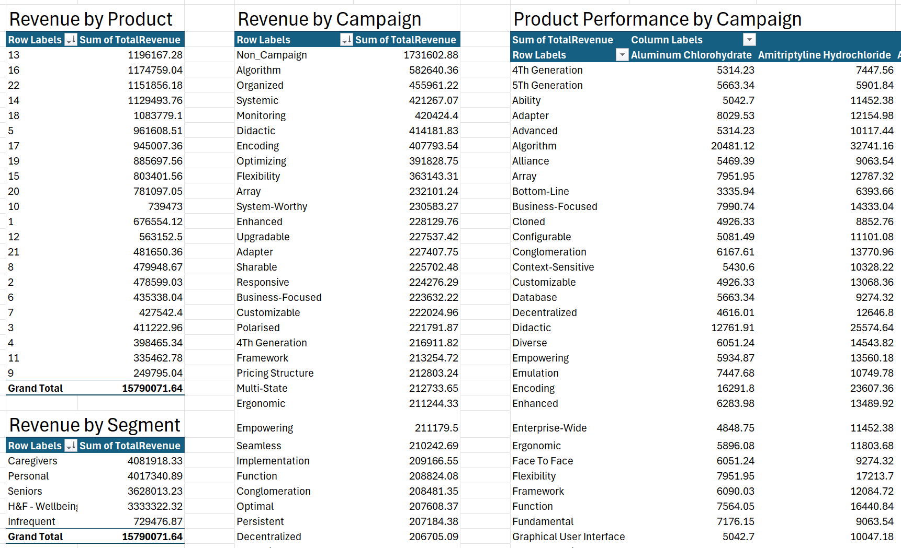
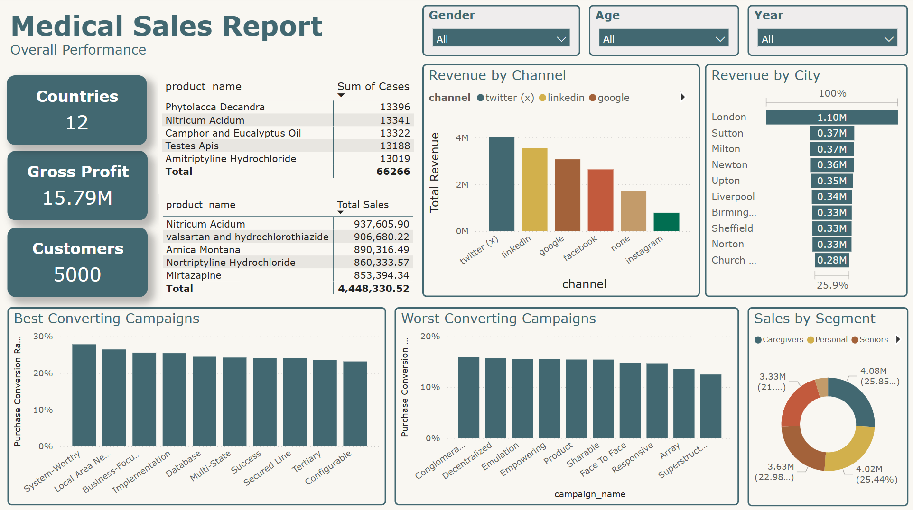

# 📦 Medical Sales Analytics — Full Project (SQL → Excel → Power BI)


---

## 📌 Project Overview

This end-to-end project simulates a real-world analytics workflow for a synthetic medical supplier. It focuses on analysing customer behaviour, campaign performance, and product sales using SQL (data cleaning & exploration), Excel (prototype KPIs), and Power BI (final dashboard).

**Dataset:**  
The project uses a synthetic relational database with five core tables: `Customers`, `Campaigns`, `Products`, `Purchases`, and `Interactions`.  
I created the dataset from scratch using CSVs and imported it into MySQL Workbench. This approach allowed full control over structure and relationships, since most public datasets lacked enough rows, multi-table join logic or realistic business structure.  
Some quirks in the dataset were intentional or preserved to reflect the kinds of inconsistencies you often encounter in real-world data.

**How to Use:**  
- Open the `.pbix` file in Power BI Desktop to explore the interactive dashboard  
- Run `.sql` scripts in MySQL Workbench for data cleaning and analysis  
- Use the `.xlsx` file to view prototype KPIs and pivot table insights

---

## 🎯 Business Objective

The business wanted to understand how different campaigns, customers, and products contributed to overall revenue and profitability. Stakeholders needed clear insights to inform future campaign planning, customer targeting, and product stocking decisions.

---

## 🧠 Executive Questions Answered

This project was structured around answering real-world stakeholder questions that evolved over the course of the analysis:

### 📍 Initial Questions (Before Data Review)
- Which marketing campaigns generated the most revenue?
- Who are our most valuable customers by region or segment?
- Which products are top sellers across different time periods?
- Are our campaigns actually converting interest into purchases?
- Where should we focus future marketing budget?

### 🔁 Refined Questions (After Excel Review & Feedback)
- Are certain **channels** (e.g., SMS, email, LinkedIn) more effective than others?
- Are **"Frequent Buyers"** spending more or just interacting more?
- What does **rolling revenue over time** reveal about seasonal trends or campaign timing?
- Which **product categories perform best within high-performing campaigns**?
- Can we approximate **ROI or profit per campaign**, and tie it to conversion rates?

> These questions were answered across SQL, Excel, and Power BI — with the final dashboard summarizing key metrics and trends in an interactive format.

---

## 🗂 Project Structure

| Step | Tool | Description |
|------|------|-------------|
| 🧹 **1. SQL Data Cleaning** | MySQL | Created staging tables, removed duplicates, standardized text, handled nulls, set up PKs/FKs |
| 🔎 **2. SQL Exploration** | MySQL | Used CTEs, joins, window functions to analyse campaign performance, customer spend, product trends |
| 📊 **3. Excel Prototyping** | Excel | Built pivot tables/charts to validate metrics and preview insights for stakeholder feedback |
| 📈 **4. Dashboarding** | Power BI | Built a final interactive dashboard with KPIs, dynamic filters, and insightful visualizations |

---

## 📁 Files Included

| File | Description |
|------|-------------|
| `main_project_synthetic_medical_supplier_data_cleaning.sql` | SQL script for staging, cleaning, normalization, PKs/FKs |
| `main_project_synthetic_medical_supplier_data_exploration.sql` | SQL for trend analysis, campaign ranking, customer value, product sales, conversion rates |
| `main_project_synthetic_medical_supplier_data.xlsx` | Excel workbook used to prototype metrics, test assumptions, and present interim findings |
| `main_project_synthetic_medical_supplier_dashboard.pbix` | Final Power BI dashboard for stakeholder use |

---

## 🔍 SQL Snapshot: Campaign Performance Query
This SQL block aggregates sales, budget, and a simulated conversion rate by campaign — used to drive Power BI KPIs.

> 📸 Example: SQL Query for Campaign Profit, Conversion Rate & Total Revenue
> 

---

## 📊 Excel File Role

This Excel workbook was used as a **stepping stone between SQL and Power BI** — a prototype environment to validate the data, test logic, and explore trends with business users.

- Pivot tables analysed product revenue, campaign interactions, and customer spend by segment
- Early visuals sparked questions and feedback from hypothetical stakeholders
- Based on review:
  - KPIs were revised to include **conversion rates and profit** per campaign
  - Charts were redesigned to show **rolling revenue** and **channel effectiveness**

This reflects a real analyst workflow where Excel plays a critical role in aligning stakeholders before formal dashboard production.

### 🧠 Example Excel Formula

Used to calculate product-level revenue across 5 possible product ID + case volume pairings in a single row:

```excel
=SUM(
  IF(E2>0, XLOOKUP(E2, Products!$A:$A, Products!$D:$D) * F2, 0),
  IF(G2>0, XLOOKUP(G2, Products!$A:$A, Products!$D:$D) * H2, 0),
  IF(I2>0, XLOOKUP(I2, Products!$A:$A, Products!$D:$D) * J2, 0),
  IF(K2>0, XLOOKUP(K2, Products!$A:$A, Products!$D:$D) * L2, 0),
  IF(M2>0, XLOOKUP(M2, Products!$A:$A, Products!$D:$D) * N2, 0)
)
```

#### 📈 Excel Prototypes for Product, Campaign & Segment Analysis
> 📸 Example: Excel Pivot Table Used to Prototype Product, Campaign & Segment Performance
> 

---

## 📈 Power BI Highlights

The final Power BI dashboard includes:
- KPI cards: **Total Revenue**, **Gross Profit**, **Top Customers**
- Slicers by **year, gender, age bracket, campaign channel**
- Visuals for:
  - Revenue by **campaign**, **product**, and **segment**
  - Top product performance
  - Sales trends and rolling revenue over time
- Conversion & ROI approximations per campaign

All DAX measures were built to be **context-sensitive** and respond dynamically to filters.

### 🧮 Example DAX Measure

DAX used to calculate purchase conversion rate by campaign, while respecting slicer context:

```dax
Purchase Conversion Rate = 
VAR SelectedCampaigns =
    CALCULATETABLE(
        VALUES(Campaigns[campaign_id]),
        Purchases
    )
RETURN
    DIVIDE(
        CALCULATE(
            COUNTROWS(Interactions),
            FILTER(
                Interactions,
                Interactions[Interaction_type] = "Purchased"
            ),
            TREATAS(SelectedCampaigns, Interactions[campaign_id])
        ),
        COUNTROWS(Interactions)
    )
```

#### 📊 Power BI Dashboard Overview
> 📸 Example: Final Dashboard Overview  
> 

---

## 🛠 Tools & Skills Demonstrated

- **SQL (MySQL)**: joins, subqueries, CTEs, window functions, staging & cleaning
- **Excel**: pivot tables, XLOOKUP, `SUMIFS`, `COUNTIFS`, conditional logic
- **Power BI**: data modeling, relationships, DAX (e.g., `CALCULATE`, `TREATAS`, `SWITCH`), KPI visuals
- **Data Storytelling**: translating messy raw data into executive-ready insight
- **Stakeholder Simulation**: adjusting outputs based on feedback from an Excel prototype stage

---

## ⚠️ Known Limitation

The Power BI dashboard contains KPI cards for **Customers** and **Countries** that are not affected by the **Year slicer**.  

This is due to how the data model was initially structured, where `Customers` isn't directly linked to time-based facts.  
In a real-world scenario, this would be resolved by:
 - Creating a proper **date dimension**
 - Rebuilding KPIs using **fact-based filtering**  

Left unresolved due to project scope constraints, but would be prioritized in a production setting.

---

## 🚀 Future Improvements

- Refactor Power BI data model for more flexible time-based slicing
- Build a SQL view or stored procedure to automate cleaning logic
- Add year-over-year campaign performance comparisons
- Explore RFM (recency, frequency, monetary) segmentation

---

## 📬 Contact

Feel free to reach out with any questions or feedback:  
📧 mitchellrogers.uk@gmail.com

🔗 [Back to Portfolio](https://mjr-portfolio.github.io/mjr_analyst_portfolio.github.io/)
